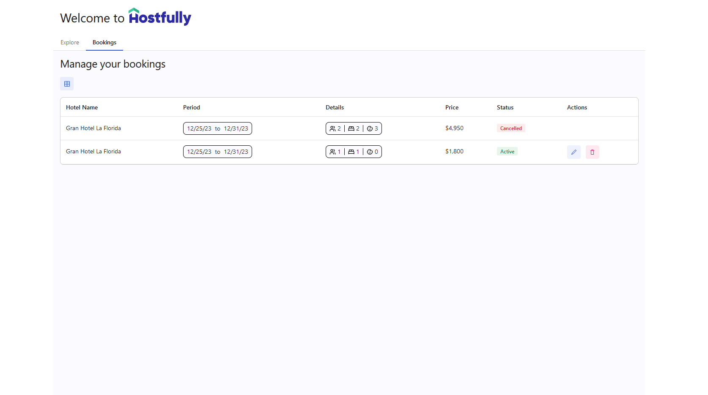
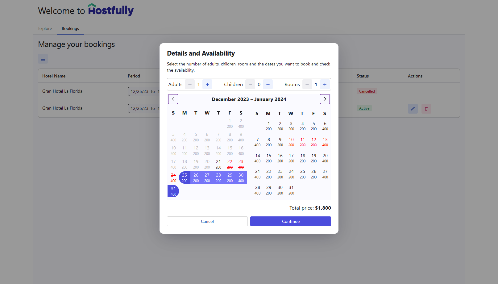

# Hostfully challenge

This project was created to fulfill the requirements of the Hostfully challenge.

## App architecture

You can find the app architecture [here](src/docs/appArchitecture.md).

## Media






### Desktop video

https://www.loom.com/share/51568fa645764a718efc4425503cfdc7?sid=f78ceb5e-6ac0-41e7-a82e-3af250da2230

### Mobile video

https://www.loom.com/share/9701cd39167f417892c574259b5115ae?sid=e8c76b77-f4d9-4c3a-91c6-1da79934b387

## Technologies

- [React](https://reactjs.org/)
- [TypeScript](https://www.typescriptlang.org/)
- [Zustand]
- [Vite](https://vitejs.dev/)
- [Radix](https://www.radix-ui.com/)
- [Styled Components](https://styled-components.com/)
- [Cypress](https://www.cypress.io/)
- [React Aria Components](https://react-spectrum.adobe.com/react-aria/index.html)
- [React Hook Form](https://react-hook-form.com/)
- [Yup]

## Getting Started

First, install the dependencies:

```bash
npm install
# or
yarn
```

Then, run the development server:

```bash
npm run dev
# or
yarn dev
```

## Testing

```bash
npx cypress open
```
