## App Architecture

### Image generated by mermaid

[![](https://mermaid.ink/img/pako:eNqdV11v4jgU_SuWq4pWAlRoCJCHGYWQTKuhsCr0YXezWpnEKVFDghIz0y7w3_facb5KCp2hLyXn3OP77bDDTuRSrOHLy50f-kxDuwZb0TVtaI3Af16xxuFweWmHXhD9dFYkZmgxtkOUbJfPMdms0FNC479trG82Nv4HAPlxApIkY-ohlzp-4kch8vwg0NCFZRlKT2k6URDF2kVn2Ol39WbC4uiFtn76Lltpyua1Roc47PdV5gwcv7qysfjHxtfXBZZHcjeBOO4iRoMETfyEVeLJPgLPeKhTy5lB_uIkVcqp3bPULnDb7XaFR0O3xtMR93QURS9--HzCV8kouCf9LdFO-XrWy5FVUrKgaypUY_bwx8RcmOOdjTmIjGi9CSij7lcbHwqe9Th7AIpBgoC6yIqjdQV-mI1NgB-gdSvPdWNxP5vOAdJFv1RAQ58a5uRfYza17h-FehR6frxGBgkdGgSEW3ytMxnNZt_vp9-ggTyieaTFYpKsJIgkCF1V2Jnj-8WRFXV9JpDMBB3Z1HBlSBWq8WjqCzMnb4JtIp_V0osW5402JozknV5baV3X877l7E-0JF8DUCwACV8H_CvKvtee8WScpH3Q-LLnS-1fKz5flAfkTAjsLaDphki3y4VyY-h6J1supmqqliWXC4CGMh4bGeh53nslSF6mU6GmOu_ZT8YvkOeLXyCn5Uv5MobKunzPz0b28xbV4ZCGltXvFpu5Jj-iqSV821PokDRTS-DmWU6BOtP8uN-TkFNSV-gaX0V_yrhu4a9_lDRLwgO9NxrrJ6TuJij38UjlBJaP7MeU8uydOCQbhwojHwWIpNWSmzBBYv20Wq0v4FuKpwMCFPN1AzFSxMgSkQTud49sA458gRhTLsTKtQLfeUmKcxdgUFYclVmZakYqSXHWN3OBVunVHMB1l7oGkyZJotWrR6IpXC5XstxruCeuZTxWOV6uu-VF3obkB_EDsoRMuYTRRHjxZJTJZuhC9vilJZTyq0zTtOwtJ6XnCBfZ_0mTvbiwzvCm0V5ce0c0_lAwZJL2eXZyJEvyPs8uP1DEsDehlnsxO-8RI6YQ6l4ORbkqPC_LrHAu7z4R8lxKZLtCVCG9cI68ls9Tx3k7SaN9ZYyPuWkLFuzqrX10TGUn8CLxo3i9UbnaVZGiLNUV9hEXidpkmZU9BWfpriubhUVpGznZGLbK7VO1WObJK2VUbMXM_fOMU4dVtzJYPNJ19IMKVZo57MEb1acF5pQluVMJIwxeN2D0G_K9ibqNwlU7xE28pvGa-C78qthxTRuLXxQ21uBfuTBsbIcHoJIti-ZvoYM1Fm9pE2833MGxT-DGX2N4uwkSeLoh4V9RtM5I8BVrO_yKtU5_2FYGPbWrdrs3_ZvbTreJ37CmDtrqoK8OB7eq0u31B51DE_8nBG7ag06nr6q3ijJUAOmrh_8BXei_Jw?type=png)](https://mermaid.live/edit#pako:eNqdV11v4jgU_SuWq4pWAlRoCJCHGYWQTKuhsCr0YXezWpnEKVFDghIz0y7w3_facb5KCp2hLyXn3OP77bDDTuRSrOHLy50f-kxDuwZb0TVtaI3Af16xxuFweWmHXhD9dFYkZmgxtkOUbJfPMdms0FNC479trG82Nv4HAPlxApIkY-ohlzp-4kch8vwg0NCFZRlKT2k6URDF2kVn2Ol39WbC4uiFtn76Lltpyua1Roc47PdV5gwcv7qysfjHxtfXBZZHcjeBOO4iRoMETfyEVeLJPgLPeKhTy5lB_uIkVcqp3bPULnDb7XaFR0O3xtMR93QURS9--HzCV8kouCf9LdFO-XrWy5FVUrKgaypUY_bwx8RcmOOdjTmIjGi9CSij7lcbHwqe9Th7AIpBgoC6yIqjdQV-mI1NgB-gdSvPdWNxP5vOAdJFv1RAQ58a5uRfYza17h-FehR6frxGBgkdGgSEW3ytMxnNZt_vp9-ggTyieaTFYpKsJIgkCF1V2Jnj-8WRFXV9JpDMBB3Z1HBlSBWq8WjqCzMnb4JtIp_V0osW5402JozknV5baV3X877l7E-0JF8DUCwACV8H_CvKvtee8WScpH3Q-LLnS-1fKz5flAfkTAjsLaDphki3y4VyY-h6J1supmqqliWXC4CGMh4bGeh53nslSF6mU6GmOu_ZT8YvkOeLXyCn5Uv5MobKunzPz0b28xbV4ZCGltXvFpu5Jj-iqSV821PokDRTS-DmWU6BOtP8uN-TkFNSV-gaX0V_yrhu4a9_lDRLwgO9NxrrJ6TuJij38UjlBJaP7MeU8uydOCQbhwojHwWIpNWSmzBBYv20Wq0v4FuKpwMCFPN1AzFSxMgSkQTud49sA458gRhTLsTKtQLfeUmKcxdgUFYclVmZakYqSXHWN3OBVunVHMB1l7oGkyZJotWrR6IpXC5XstxruCeuZTxWOV6uu-VF3obkB_EDsoRMuYTRRHjxZJTJZuhC9vilJZTyq0zTtOwtJ6XnCBfZ_0mTvbiwzvCm0V5ce0c0_lAwZJL2eXZyJEvyPs8uP1DEsDehlnsxO-8RI6YQ6l4ORbkqPC_LrHAu7z4R8lxKZLtCVCG9cI68ls9Tx3k7SaN9ZYyPuWkLFuzqrX10TGUn8CLxo3i9UbnaVZGiLNUV9hEXidpkmZU9BWfpriubhUVpGznZGLbK7VO1WObJK2VUbMXM_fOMU4dVtzJYPNJ19IMKVZo57MEb1acF5pQluVMJIwxeN2D0G_K9ibqNwlU7xE28pvGa-C78qthxTRuLXxQ21uBfuTBsbIcHoJIti-ZvoYM1Fm9pE2833MGxT-DGX2N4uwkSeLoh4V9RtM5I8BVrO_yKtU5_2FYGPbWrdrs3_ZvbTreJ37CmDtrqoK8OB7eq0u31B51DE_8nBG7ag06nr6q3ijJUAOmrh_8BXei_Jw)

### Flow (mermaid)

```mermaid
flowchart TD
 subgraph User["App"]
        classDef decision fill: #FFC454,color:#19172A,stroke-width:4px
        classDef action fill: #FFC454,color:#19172A,stroke-width:4px
        Start(("Start"))
        subgraph HL["Hotels List"]
                Hotel["Hotel 1"]
                OthersHotels["Hotel 2"]
                OthersHotels2["..."]
        end
        subgraph BL["Bookings List"]
                Booking["Booking 1"]
                Others["Booking 2"]
                Others2["..."]
        end
        BF["Booking Flow"]
        COMPLETED{"Flow Completed?"}
        FROM{"Called From"}
        MODE{"Mode"}
        ACTIONS{"Action"}
        CANCEL_CONFIRM{"Confirm Cancellation?"}
        CANCEL_BOOKING("fa:fa-trash CANCEL BOOKING")
        EDIT_BOOKING("fa:fa-edit EDIT BOOKING ")
        EDIT("fa:fa-edit EDIT ACTIONS")
        CREATE("fa:fa-plus CREATE ACTIONS")
        subgraph HotelData["Hotels"]
                AAA["Hotel Data"]
        end
        subgraph UserCalendar["User Calendar"]
                UC["User Calendar"]
        end
        subgraph Bookings["Bookings"]
                ST["Bookings Data"]
        end
        style Start fill:#40CAA1,color:#E6E6FF,stroke:#4C4DDC,color:#fff
        style AAA fill:#4C4DDC,color:#E6E6FF
        style UC fill:#4C4DDC,color:#E6E6FF
        style ST fill:#4C4DDC,color:#E6E6FF
        style Hotel fill:#E6E6FF,color:#19172A
        style Booking fill:#E6E6FF,color:#19172A
        style CANCEL_BOOKING fill:#FF7254,color:#fff
        style EDIT color:#354e9a,fill:#fff,stroke:#354e9a
        style EDIT_BOOKING color:#354e9a,fill:#fff,stroke:#354e9a
        style CREATE fill:#40CAA1,color:#fff
        style User fill:#F3F3F7
        style BF fill:#8A5BDA,color:#fff
        style HL fill:#fff
        style BL fill:#fff
        style HotelData fill:#fff
        style UserCalendar fill:#fff
        style Bookings fill:#fff
  end
    BF -- Cancels edit ---> BL
    Start -- Explore tab as default --> HL
    HL -- Clicks Bookings Tab --> BL
    BL -- Clicks Explore Tab --> HL
    HL  -- GET hotels list ---> AAA
    Hotel -- Clicks Book Now (CREATE mode) ---> BF
    BF -- GET user unavailable dates --> UC
    BF -- Ends flow ---> COMPLETED:::decision
    COMPLETED -->|Yes| MODE:::decision
    COMPLETED -->|No| FROM:::decision
    FROM -->|Explore| HL
    FROM -->|Bookings| BL
    MODE --> |Edit| EDIT
    MODE --> |Create| CREATE
    BL -- GET bookings data ---> ST
    Booking --> ACTIONS:::decision
    ACTIONS -->|Edit Booking| EDIT_BOOKING
    ACTIONS -->|Cancel Booking| CANCEL_CONFIRM:::decision
    EDIT_BOOKING -- Edit mode --> BF
    CANCEL_CONFIRM -->|Yes| CANCEL_BOOKING
    CANCEL_CONFIRM --> |No| BL
    CREATE -- Add dates to user calendar ---> UC
    CREATE -- Add booking ---> ST
    EDIT -- Edit booking ---> ST
    EDIT -- Edit user calendar ---> UC
    CANCEL_BOOKING -- Remove booked dates from calendar ---> UC
    CANCEL_BOOKING -- Sets booking status as 'Cancelled' ---> ST
```

